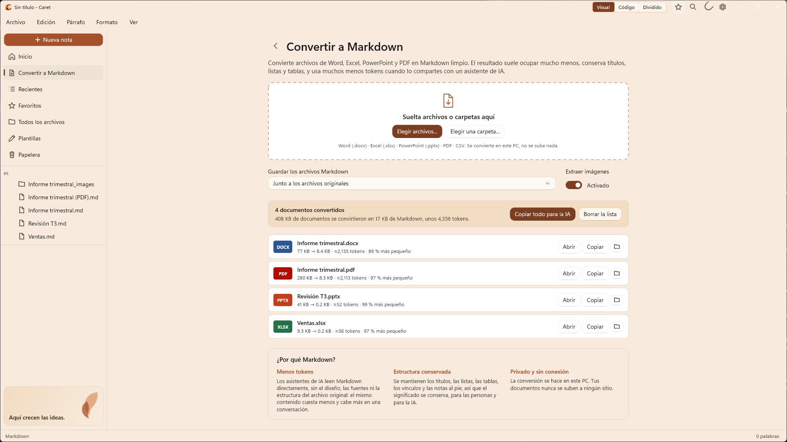
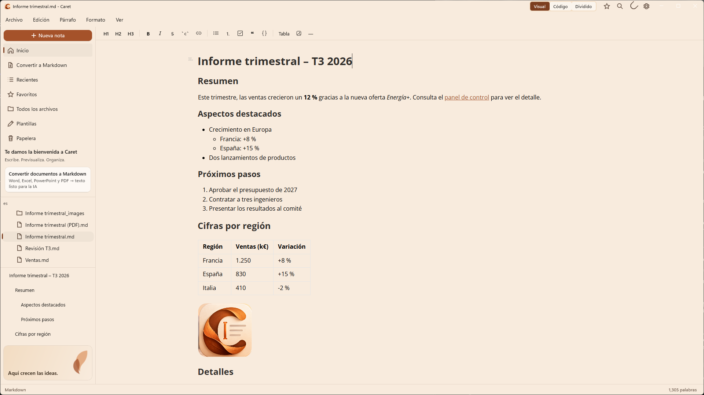

  

<h1 align="center">Caret</h1>

  <strong>Convierte tus documentos de Office en Markdown listo para la IA y escribe con tranquilidad en Windows.</strong>

  <a href="README.md">English</a> · <a href="README.fr.md">Français</a> · Español

  

---

## Por qué Caret

Gran parte de lo que sabemos está en documentos de Word, libros de Excel, presentaciones de PowerPoint y PDF. Los asistentes de IA como Copilot y ChatGPT funcionan mejor con texto sin formato, y cada archivo adjunto cuesta tokens, tiempo y límites de subida.

**Caret convierte esos archivos a Markdown**: un texto limpio que conserva los títulos, las listas, las tablas, los vínculos y las notas al pie, y deja fuera todo lo demás. El resultado suele ocupar **entre un 90 y un 99 % menos** que el archivo original, lo leen igual de bien las personas y la IA, y nunca sale de tu PC.

Después, Caret te ofrece un editor de Markdown nativo y tranquilo para leer, editar y organizar el resultado.

| Ejemplo (pruebas de Caret) | Original | Markdown | ≈ Tokens |
| --- | --- | --- | --- |
| Informe trimestral, Word | 77 KB | 8,4 KB | 2135 |
| El mismo informe en PDF | 280 KB | 8,3 KB | 2113 |
| Libro de ventas, Excel | 9,3 KB | 0,2 KB | 56 |
| Presentación, PowerPoint | 41 KB | 0,2 KB | 52 |

El número de tokens es una estimación (unos cuatro caracteres por token); la cifra exacta depende del modelo de IA.

## Convertir a Markdown

Abre **Convertir a Markdown** en la barra lateral, justo debajo de Inicio, y suelta archivos o una carpeta entera.

- **Word** (.docx): títulos, listas anidadas, negrita y cursiva, vínculos, tablas (también con celdas combinadas), notas al pie e imágenes
- **Excel** (.xlsx): cada hoja visible como tabla, con fechas, porcentajes y resultados de fórmulas legibles
- **PowerPoint** (.pptx): una sección por diapositiva, con niveles de viñetas, tablas y notas del orador
- **PDF**: títulos, listas, tablas y diseños a dos columnas reconstruidos, sin encabezados ni números de página repetidos
- **CSV**: coma o punto y coma, detectados automáticamente

Cada archivo muestra su tamaño antes y después y una estimación de sus tokens. **Copiar todo para la IA** pone todo en el Portapapeles como un único texto, listo para pegar en un asistente. Los archivos Markdown se guardan junto a los originales o en la carpeta que elijas, y nunca se sobrescribe un archivo existente.

**Todo está integrado**: sin Python, sin complementos, sin conexión a Internet y sin subir nada. Por eso Caret sirve también en equipos de empresa donde instalar herramientas está restringido.

## Un editor de Markdown tranquilo

  

- **Visual, Código o Dividido**: edición con formato, Markdown sin formato, o ambos a la vez con vista previa en directo
- **Barra de herramientas de formato**, menús Párrafo y Formato y métodos abreviados habituales
- **Tablas, fórmulas, notas al pie y diagramas** (Mermaid, diagramas de flujo, de secuencia, PlantUML, Vega-Lite)
- **Pega imágenes y capturas de pantalla** directamente en una nota
- **Espacio de trabajo por carpetas**, **Ir al archivo** (`Ctrl+K`), favoritos, archivos recientes, plantillas y papelera
- **Guardado automático** y **recuperación tras un error**, incluso para notas sin título
- **Español, inglés y francés**, temas claro y oscuro, exportación a HTML, PDF o texto sin formato

## Consigue Caret

- **Microsoft Store**: muy pronto.
- **GitHub**: descarga el último `.msix` y `Caret.cer` desde las [versiones publicadas](https://github.com/fegyenc/Caret/releases/latest) y sigue los dos pasos de instalación del [README en inglés](README.md#get-caret).
- **Para organizaciones**: [docs/deployment.md](docs/deployment.md) explica la implementación con Intune y el Portal de empresa, las directivas y el uso de la red.

Requiere Windows 10 versión 1809 o posterior (x64 o ARM64); se recomienda Windows 11.

## Privacidad

Caret no recopila nada: sin cuenta y sin telemetría. Los documentos se convierten y se editan en tu PC. La única conexión que Caret hace por su cuenta es una búsqueda diaria de actualizaciones en la versión de GitHub, que puedes desactivar; la versión de Store no la hace nunca. Más información: [PRIVACY.md](PRIVACY.md#español).

## Licencia y contribuciones

[Licencia MIT](LICENSE). Caret deriva de [Typedown](https://github.com/byxiaozhi/Typedown), de ZZF. Los componentes de terceros se enumeran en [THIRD-PARTY-NOTICES.md](THIRD-PARTY-NOTICES.md). Las sugerencias, ideas y revisiones de traducción son bienvenidas a través de las [incidencias de GitHub](https://github.com/fegyenc/Caret/issues); consulta también [docs/localization.md](docs/localization.md).
