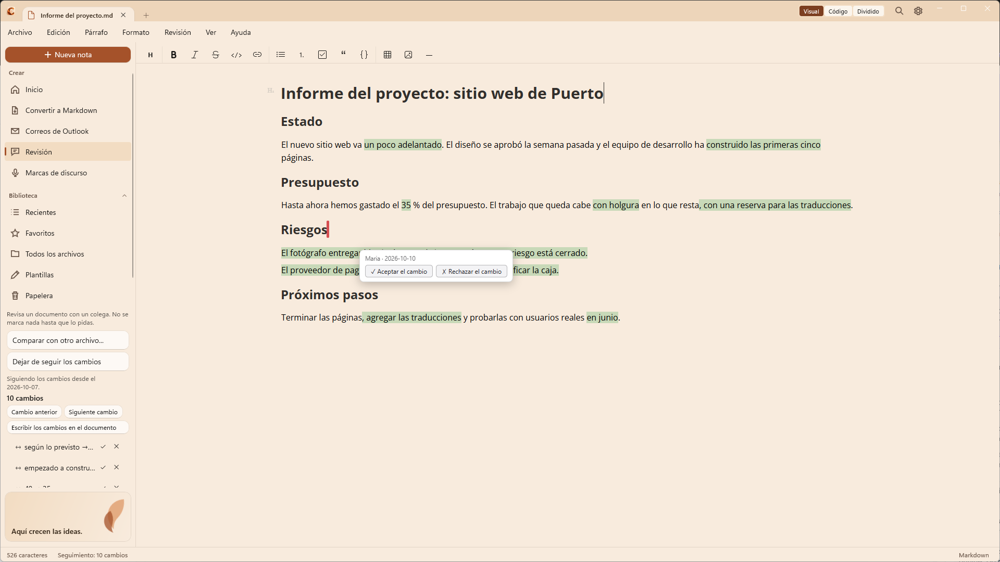
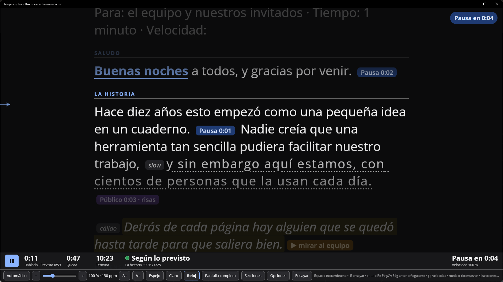
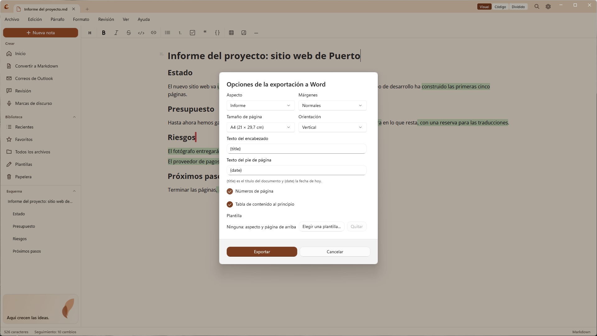
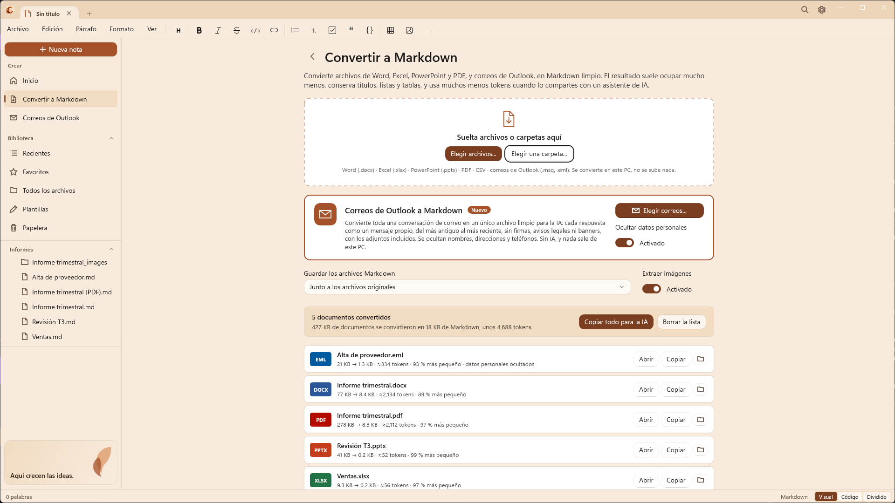
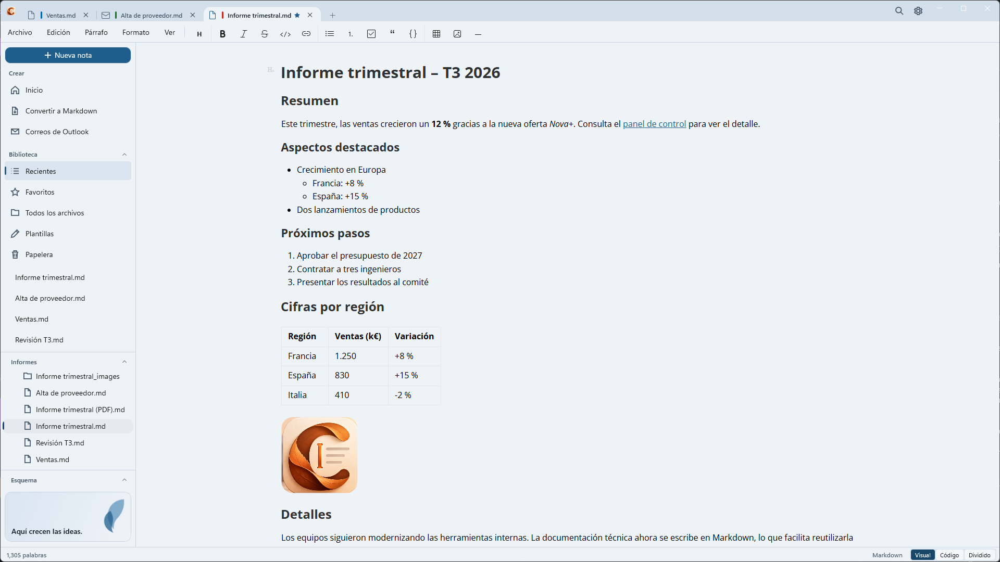

  

<h1 align="center">Caret</h1>

  <strong>Escríbelo. Sigue los cambios. Dilo.</strong> Un editor de Markdown para Windows con control de cambios y teleprompter, que convierte documentos de Office en Markdown listo para la IA y el Markdown en archivos de Word de verdad.

  <a href="README.md">English</a> · <a href="README.fr.md">Français</a> · Español · <a href="README.pl.md">Polski</a> · <a href="README.pt.md">Português</a>

  

---

## Control de cambios, integrado

Activa **Revisión > Seguir los cambios** y Caret recuerda la versión de la que partiste. Mientras editas, cada adición y cada eliminación se dibuja en color: en verde lo que agregaste y en rojo lo que quitaste, en la vista Visual y junto al código en la vista Dividida.

- **Una lista de los cambios** con la que te mueves por el documento: haz clic en uno para ir a él y acéptalo o recházalo, o acepta o rechaza todos a la vez
- **Cada cambio recuerda el día en que se vio por primera vez**, y el seguimiento continúa después de cerrar Caret (Caret guarda la versión inicial en su propia carpeta de datos, nunca en tu archivo)
- **Escribe los cambios en el documento** con **Revisión > Escribir los cambios en el documento**: el autor y la fecha quedan como texto sin formato en el archivo, y un colega o un asistente de IA puede leerlos sin Caret
- **Comentarios y comparación**: agrega un comentario al texto seleccionado o compara un archivo con una versión anterior para ver qué cambió un colega
- Sin complementos, sin servidor, sin cuenta. Las marcas son [CriticMarkup](https://criticmarkup.com), una convención abierta de texto sin formato que otras herramientas también entienden

## Marcas de discurso y teleprompter

  

Para quien da discursos. Escribe el discurso en Caret y marca cómo darlo, directamente en el texto:

- **Marcas de discurso**: pausas, un ritmo más lento o más rápido, énfasis, pasajes fuertes y suaves, tono e indicaciones, escritas como pequeñas marcas de texto sin formato. Crea tus propias marcas y recetas de un clic en **Configuración > Marcas de discurso**
- **Tiempo**: Caret suma el tiempo del discurso (tus palabras a tu velocidad, más las pausas) frente a los minutos que tienes para cada sección, con un semáforo
- **Teleprompter** (**Ver > Teleprompter**): se abre en una segunda pantalla si hay una. El texto se mueve con suavidad a tu ritmo, del 25 % al 300 %, con cuenta regresiva, banda de enfoque, cuenta regresiva hasta la siguiente pausa, una lista de secciones a las que saltar, y a tu elección ancho del texto, interlineado y juego de colores (también de alto contraste), y espejo y volteo para el cristal de un teleprompter. Puede seguir el plan o moverse a velocidad constante
- **Reloj de discurso** (**Ver > Reloj de discurso**, o dentro del teleprompter): el tiempo hablado, el tiempo restante, adelantado o atrasado respecto del plan y la hora a la que terminarás
- **Ensayar**: lee el discurso en voz alta y pulsa unas teclas, y Caret mide cuánto tardó realmente cada párrafo y tu ritmo real. No se graba ni se reconoce audio; el resumen se guarda en un archivo `.rehearsal.md` junto al discurso (o se copia al portapapeles si el discurso aún no tiene archivo)
- **Plantillas iniciales** de un discurso y de una presentación, en todos los idiomas de Caret

| Tecla en el teleprompter | Qué hace |
| --- | --- |
| `Espacio` | Iniciar o detener (antes hay una cuenta regresiva) |
| `←` `→` | Párrafo anterior o siguiente (un control de presentaciones también sirve) |
| `↑` `↓` | Velocidad |
| Rueda del ratón, clic | Mover la línea de lectura, o ir a la línea en la que haces clic |
| `J`, `O` | Lista de secciones, opciones |
| `M`, `V`, `F` | Espejo, voltear, pantalla completa |
| `E` | Ensayar |

Más en **Ayuda > El teleprompter** y **Ayuda > Marcas de discurso**.

## Exportar a Word

  

**Archivo > Exportar > Documento de Word (.docx)** escribe el documento como un archivo de Word de verdad, en tu PC: Word no tiene que estar instalado y no se sube nada.

- **Estructura real de Word**: títulos de Word (así funciona el panel de navegación), listas, tablas con la fila de encabezado repetida, citas, código, enlaces e imágenes con su texto alternativo
- **Notas al pie, ecuaciones y diagramas**: las notas son notas al pie de Word, las fórmulas `$...$` son ecuaciones de Word, y los diagramas mermaid, flowchart, sequence y vega-lite son imágenes
- **Tu revisión va con él**: los comentarios y cambios se convierten en comentarios y cambios con seguimiento de Word, con sus autores y sus días. Un documento cuyos cambios estás siguiendo se puede exportar con ellos, sin escribirlos en el archivo
- **Tabla de contenido y enlaces dentro del documento**: una línea `[TOC]` y los enlaces `[texto](#título)` funcionan en Word
- **Aspectos y tu propia plantilla**: cuatro aspectos (Sencillo, Informe, Carta, Moderno), A4, Letter o Legal, orientación, márgenes, encabezado, pie de página y números de página, o escribir sobre una plantilla de Word tuya para usar las fuentes, la página, el encabezado y el pie de página de tu empresa
- En el otro sentido, **Convertir a Markdown** lee un archivo de Word y lo pasa a Markdown

Más en **Ayuda > Exportar a Word**.

## Por qué Caret

Gran parte de lo que sabemos está en documentos de Word, libros de Excel, presentaciones de PowerPoint y PDF. Los asistentes de IA como Copilot y ChatGPT funcionan mejor con texto sin formato, y cada archivo adjunto cuesta tokens, tiempo y límites de subida.

**Caret convierte esos archivos a Markdown**: un texto limpio que conserva los títulos, las listas, las tablas, los vínculos y las notas al pie, y deja fuera todo lo demás. El resultado suele ocupar **entre un 90 y un 99 % menos** que el archivo original, lo leen igual de bien las personas y la IA, y nunca sale de tu PC.

Después, Caret te ofrece un editor de Markdown nativo y tranquilo para leer, editar y organizar el resultado.

| Ejemplo (pruebas de Caret) | Original | Markdown | ≈ Tokens |
| --- | --- | --- | --- |
| Informe trimestral, Word | 77 KB | 8,4 KB | 2135 |
| El mismo informe en PDF | 280 KB | 8,3 KB | 2113 |
| Libro de ventas, Excel | 9,3 KB | 0,2 KB | 56 |
| Presentación, PowerPoint | 41 KB | 0,2 KB | 52 |

El número de tokens es una estimación (unos cuatro caracteres por token); la cifra exacta depende del modelo de IA.

## Convertir a Markdown

  

Abre **Convertir a Markdown** en la barra lateral, justo debajo de Inicio, y suelta archivos o una carpeta entera. O, sin abrir la ventana de Caret: haz clic derecho en un archivo, varios archivos o una carpeta en el Explorador de archivos y elige **Convertir a Markdown** (en la versión de la Store y la instalada; un administrador puede desactivarlo, consulta la [guía de despliegue](docs/deployment.md)).

- **Word** (.docx): títulos, listas anidadas, negrita y cursiva, vínculos, tablas (también con celdas combinadas), notas al pie e imágenes
- **Excel** (.xlsx): cada hoja visible como tabla, con fechas, porcentajes y resultados de fórmulas legibles
- **PowerPoint** (.pptx): una sección por diapositiva, con niveles de viñetas, tablas y notas del orador
- **PDF**: títulos, listas, código, tablas (con o sin líneas, con los títulos que abarcan varias columnas) y columnas reconstruidos y leídos en el orden correcto, enlaces web conservados, sin encabezados, números de página ni sellos al margen
- **CSV**: coma o punto y coma, detectados automáticamente
- **Correos de Outlook** (.msg, .eml): toda la conversación en un solo archivo, cada respuesta como un mensaje propio, del más antiguo al más reciente, sin firmas, avisos legales ni banners de «remitente externo», con los adjuntos convertidos en el mismo lugar. Tienen su propio acceso: **Correos de Outlook** en la barra lateral y en Inicio, y una tarjeta con **Elegir correos...** en la página de conversión. Los correos guardados desde Outlook (arrastrados de Outlook a una carpeta) también se pueden soltar como cualquier archivo

**Ocultar datos personales** (activado por defecto, en la tarjeta de correos) sustituye nombres, direcciones de correo, teléfonos, IBAN, números de tarjeta y de identidad por marcadores como `[PERSON-1]`, siempre el mismo para la misma persona, para que la conversación se lea bien al pegarla en un asistente de IA. Funciona con reglas y dígitos de control, no con IA: las personas se reconocen a partir de los remitentes y destinatarios del correo y de los nombres en saludos («Hola Lucía,») y despedidas, así que un nombre que solo aparece dentro de una frase no se detecta. Entiende correos en español, inglés, francés y polaco; las reglas son [archivos JSON](plugins/markitdown-email/src/markitdown_caret_email/rules) que una empresa puede ampliar.

Cada archivo muestra su tamaño antes y después y una estimación de sus tokens. **Copiar todo para la IA** pone todo en el Portapapeles como un único texto, listo para pegar en un asistente. Los archivos Markdown se guardan junto a los originales o en la carpeta que elijas, y nunca se sobrescribe un archivo existente.

**Todo está integrado**: sin Python, sin complementos, sin conexión a Internet y sin subir nada. Por eso Caret sirve también en equipos de empresa donde instalar herramientas está restringido.

## Un editor de Markdown tranquilo

  

- **Visual, Código o Dividido**: edición con formato, Markdown sin formato, o ambos a la vez con vista previa en directo
- **Barra de herramientas de formato**, menús Párrafo y Formato y métodos abreviados habituales
- **Tablas, fórmulas, notas al pie y diagramas** (Mermaid, diagramas de flujo, de secuencia, PlantUML, Vega-Lite)
- **Pega imágenes y capturas de pantalla** directamente en una nota
- **Pestañas**: varios documentos en una misma ventana, cada uno con su propio historial para deshacer. `Ctrl+Tab` cambia de uno a otro, `Ctrl+W` cierra el documento y la ventana queda abierta en una página de inicio. Tus documentos guardados se vuelven a abrir al iniciar Caret (se puede desactivar en Configuración)
- **Espacio de trabajo por carpetas**, **Ir al archivo** (`Ctrl+K`), favoritos, archivos recientes, plantillas y papelera
- **Guardado automático** y **recuperación tras un error**, incluso para notas sin título
- **Revisión ortográfica** con subrayado ondulado rojo y sugerencias con el clic derecho, con el corrector de Windows (sin conexión), en los idiomas que tienes en Windows
- **Revisión en color**: comentarios en amarillo, adiciones en verde, eliminaciones en rojo; acepta o rechaza cada cambio o todos a la vez, y compara un archivo con una versión anterior para ver qué ha cambiado un compañero. Todo es texto sin formato dentro del documento ([CriticMarkup](https://criticmarkup.com)), que pueden leer las personas y los asistentes de IA. Sin servidor ni cuenta
- **Español, inglés, francés y polaco**, temas claro y oscuro, exportación a HTML, PDF o texto sin formato

## Consigue Caret

- **Microsoft Store** (recomendado): [consigue Caret en Microsoft Store](https://apps.microsoft.com/detail/9n617shlqm8g), o ejecuta `winget install --source msstore --id 9N617SHLQM8G`. No hay que confiar en ningún certificado y se actualiza solo.
- **GitHub**: descarga el último `.msix` y `Caret.cer` desde las [versiones publicadas](https://github.com/fegyenc/Caret/releases/latest) y sigue los dos pasos de instalación del [README en inglés](README.md#get-caret).
- **Para grandes empresas, pymes y autónomos**: [docs/deployment.md](docs/deployment.md) explica la implementación con Intune y el Portal de empresa, el uso de la red y las directivas que desactivan la búsqueda de actualizaciones o fijan el diseño y los colores predeterminados para todos.

Requiere Windows 10 versión 1809 o posterior (x64 o ARM64); se recomienda Windows 11.

## Privacidad

Caret no recopila nada: sin cuenta y sin telemetría. Los documentos se convierten y se editan en tu PC. La única conexión que Caret hace por su cuenta es una búsqueda de actualizaciones, aproximadamente una vez al día, en las versiones que no se instalan desde Microsoft Store (la de GitHub o un paquete que distribuye tu organización), que puedes desactivar; la versión de Store no la hace nunca. Más información: [PRIVACY.md](PRIVACY.md#español).

## Licencia y contribuciones

[Licencia MIT](LICENSE). Caret deriva de [Typedown](https://github.com/byxiaozhi/Typedown), de ZZF. Los componentes de terceros se enumeran en [THIRD-PARTY-NOTICES.md](THIRD-PARTY-NOTICES.md). Las sugerencias, ideas y revisiones de traducción son bienvenidas a través de las [incidencias de GitHub](https://github.com/fegyenc/Caret/issues); consulta también [docs/localization.md](docs/localization.md).
