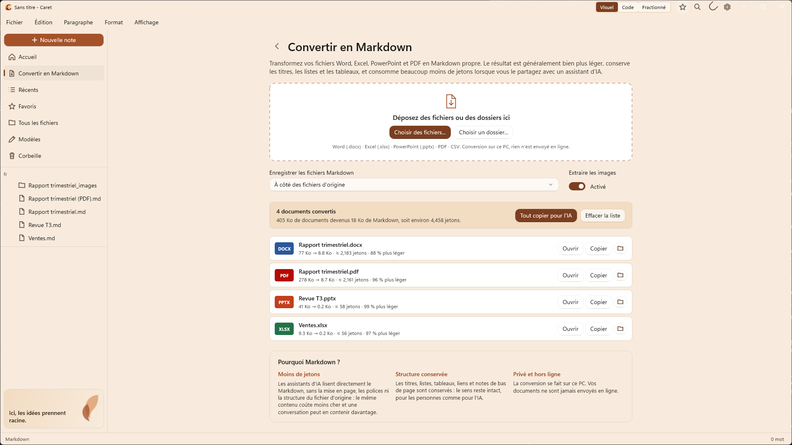
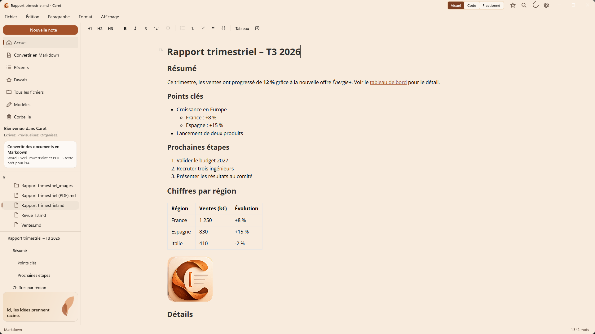

  

<h1 align="center">Caret</h1>

  <strong>Transformez vos documents Office en Markdown prêt pour l'IA, et écrivez sereinement sous Windows.</strong>

  <a href="README.md">English</a> · Français · <a href="README.es.md">Español</a>

  

---

## Pourquoi Caret

L'essentiel de nos connaissances se trouve dans des documents Word, des classeurs Excel, des présentations PowerPoint et des PDF. Les assistants d'IA comme Copilot et ChatGPT travaillent mieux avec du texte brut, et chaque fichier joint coûte des jetons, du temps et des limites de téléversement.

**Caret convertit ces fichiers en Markdown** : un texte propre qui conserve les titres, listes, tableaux, liens et notes de bas de page, sans le reste. Le résultat est généralement **90 à 99 % plus léger** que le fichier d'origine, lisible par les personnes comme par l'IA, et il ne quitte jamais votre PC.

Caret vous offre ensuite un éditeur Markdown natif et apaisant pour lire, modifier et organiser le résultat.

| Exemple (tests de Caret) | Original | Markdown | ≈ Jetons |
| --- | --- | --- | --- |
| Rapport trimestriel, Word | 77 Ko | 8,8 Ko | 2 183 |
| Le même rapport en PDF | 278 Ko | 8,7 Ko | 2 161 |
| Classeur de ventes, Excel | 9,3 Ko | 0,2 Ko | 56 |
| Présentation, PowerPoint | 41 Ko | 0,2 Ko | 58 |

Le nombre de jetons est une estimation (environ quatre caractères par jeton) ; le nombre exact dépend du modèle d'IA.

## Convertir en Markdown

Ouvrez **Convertir en Markdown** dans la barre latérale, juste sous Accueil, et déposez des fichiers ou un dossier entier.

- **Word** (.docx) : titres, listes imbriquées, gras et italique, liens, tableaux (cellules fusionnées comprises), notes de bas de page et images
- **Excel** (.xlsx) : chaque feuille visible sous forme de tableau, avec dates, pourcentages et résultats de formules lisibles
- **PowerPoint** (.pptx) : une section par diapositive, avec niveaux de puces, tableaux et commentaires du présentateur
- **PDF** : titres, listes, tableaux et mises en page sur deux colonnes reconstruits, en-têtes et numéros de page supprimés
- **CSV** : virgule ou point-virgule, détectés automatiquement

Chaque fichier affiche sa taille avant et après et une estimation de ses jetons. **Tout copier pour l'IA** place l'ensemble dans le Presse-papiers en un seul texte, prêt à coller dans un assistant. Les fichiers Markdown sont enregistrés à côté des originaux ou dans le dossier de votre choix, et aucun fichier existant n'est jamais écrasé.

**Tout est intégré** : ni Python, ni complément, ni connexion Internet, rien n'est envoyé en ligne. Caret convient donc aux ordinateurs d'entreprise sur lesquels l'installation d'outils est restreinte.

## Un éditeur Markdown apaisant

  

- **Visuel, Code ou Fractionné** : édition mise en forme, Markdown brut, ou les deux côte à côte avec aperçu en direct
- **Barre d'outils de mise en forme**, menus Paragraphe et Format, raccourcis habituels
- **Tableaux, formules, notes de bas de page et diagrammes** (Mermaid, organigrammes, séquence, PlantUML, Vega-Lite)
- **Collez des images et des captures d'écran** directement dans une note
- **Espace de travail par dossier**, **Accéder au fichier** (`Ctrl+K`), favoris, fichiers récents, modèles et corbeille
- **Enregistrement automatique** et **récupération après incident**, même pour les notes sans titre
- **Français, anglais et espagnol**, thèmes clair et sombre, exportation en HTML, PDF ou texte brut

## Obtenir Caret

- **Microsoft Store** : bientôt disponible.
- **GitHub** : téléchargez le dernier `.msix` et `Caret.cer` depuis les [versions publiées](https://github.com/fegyenc/Caret/releases/latest), puis suivez les deux étapes d'installation décrites dans le [README anglais](README.md#get-caret).
- **Pour les organisations** : [docs/deployment.fr.md](docs/deployment.fr.md) décrit le déploiement avec Intune et le Portail d'entreprise, les stratégies et l'utilisation du réseau.

Nécessite Windows 10 version 1809 ou ultérieure (x64 ou ARM64) ; Windows 11 recommandé.

## Confidentialité

Caret ne collecte rien : pas de compte, pas de télémétrie. Les documents sont convertis et modifiés sur votre PC. La seule connexion que Caret établit de lui-même est une recherche quotidienne de mises à jour dans la version GitHub, que vous pouvez désactiver ; la version du Store ne l'effectue pas du tout. Détails : [PRIVACY.md](PRIVACY.md#français).

## Licence et contributions

[Licence MIT](LICENSE). Caret est dérivé de [Typedown](https://github.com/byxiaozhi/Typedown) par ZZF. Les composants tiers sont listés dans [THIRD-PARTY-NOTICES.md](THIRD-PARTY-NOTICES.md). Remarques, idées et relectures de traduction sont les bienvenues via les [tickets GitHub](https://github.com/fegyenc/Caret/issues) ; voir aussi [docs/localization.md](docs/localization.md).
