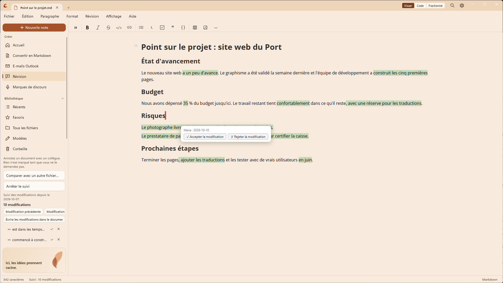
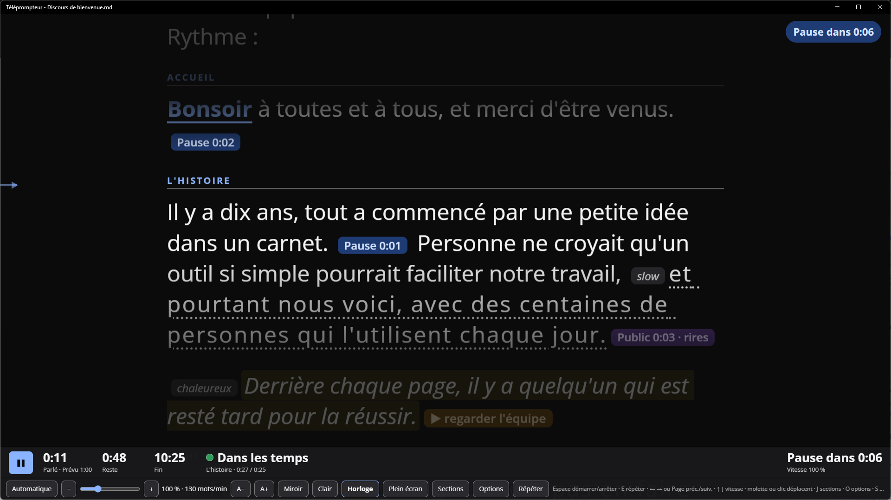
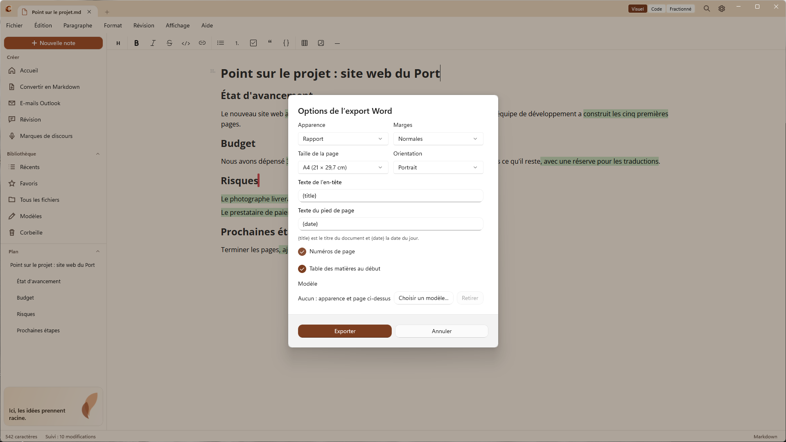
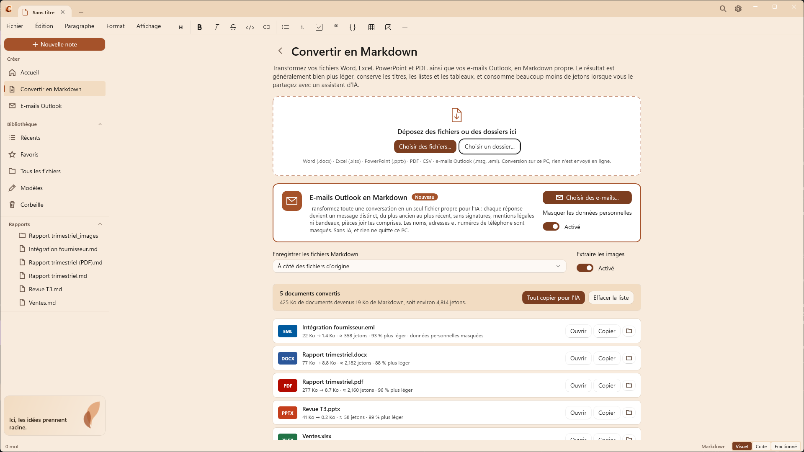
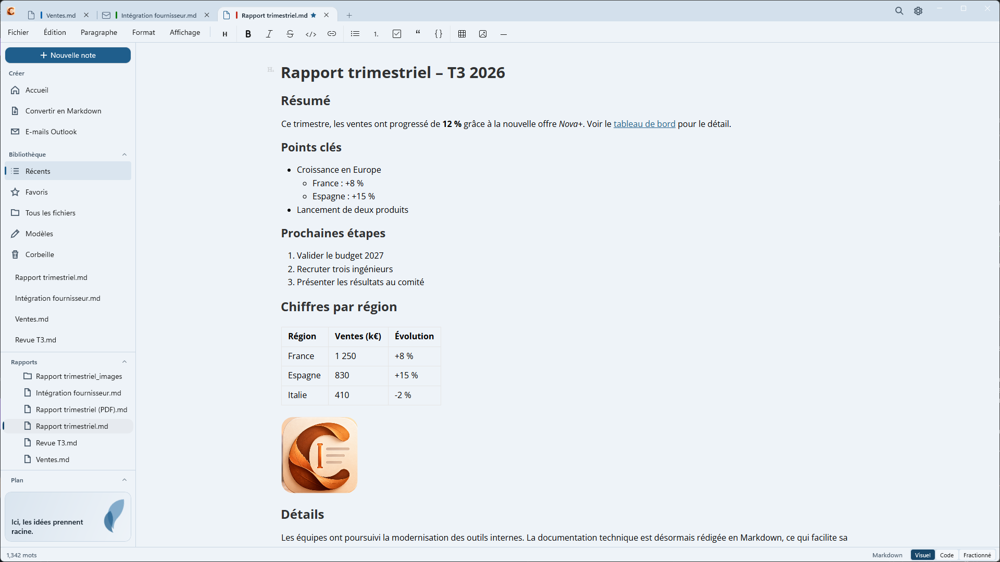

  

<h1 align="center">Caret</h1>

  <strong>Écrivez-le. Révisez-le. Dites-le.</strong> Un éditeur Markdown pour Windows avec suivi des modifications et téléprompteur, qui transforme vos documents Office en Markdown prêt pour l'IA et le Markdown en vrais fichiers Word.

  <a href="README.md">English</a> · Français · <a href="README.es.md">Español</a> · <a href="README.pl.md">Polski</a> · <a href="README.pt.md">Português</a>

  

---

## Suivi des modifications, intégré

Activez **Révision > Suivre les modifications** et Caret retient la version dont vous êtes parti. Pendant que vous éditez, chaque ajout et chaque suppression est dessiné en couleur : en vert ce que vous avez ajouté, en rouge ce que vous avez supprimé, en mode Visuel et à côté de la source en mode Fractionné.

- **Une liste des modifications** pour parcourir le document : cliquez sur l'une pour y aller, puis acceptez-la ou refusez-la, ou acceptez ou refusez-les toutes d'un coup
- **Chaque modification retient le jour où elle a été vue pour la première fois**, et le suivi continue après la fermeture de Caret (Caret garde la version de départ dans son propre dossier de données, jamais dans votre fichier)
- **Écrivez les modifications dans le document** avec **Révision > Écrire les modifications dans le document** : l'auteur et la date deviennent du texte brut dans le fichier, qu'un collègue ou un assistant d'IA peut lire sans Caret
- **Commentaires et comparaison** : ajoutez un commentaire au texte sélectionné ou comparez un fichier avec une version précédente pour voir ce qu'un collègue a changé
- Sans module complémentaire, sans serveur, sans compte. Les marques sont du [CriticMarkup](https://criticmarkup.com), une convention ouverte en texte brut que d'autres outils comprennent aussi

## Marques de discours et téléprompteur

  

Pour celles et ceux qui prennent la parole. Écrivez le discours dans Caret et indiquez comment le prononcer, directement dans le texte :

- **Marques de discours** : pauses, rythme plus lent ou plus rapide, emphase, passages forts et doux, ton et repères, écrits sous forme de petites marques en texte brut. Créez vos propres marques et des recettes d'un clic dans **Paramètres > Marques de discours**
- **Durée** : Caret additionne la durée du discours (vos mots à votre rythme, plus les pauses) et la compare aux minutes dont vous disposez pour chaque section, avec un feu tricolore
- **Téléprompteur** (**Affichage > Téléprompteur**) : s'ouvre sur un second écran s'il y en a un. Le texte défile en douceur à votre rythme, de 25 % à 300 %, avec compte à rebours, bande de lecture, compte à rebours jusqu'à la prochaine pause, une liste de sections où sauter, et à votre choix largeur du texte, interligne et jeu de couleurs (dont des jeux à fort contraste), ainsi que miroir et retournement pour la vitre d'un prompteur. Il peut suivre le plan ou avancer à vitesse constante
- **Chronomètre de parole** (**Affichage > Chronomètre de parole**, ou dans le téléprompteur) : le temps parlé, le temps restant, l'avance ou le retard sur le plan et l'heure à laquelle vous finirez
- **Répéter** : lisez le discours à voix haute et appuyez sur quelques touches, et Caret mesure le temps réellement mis par chaque paragraphe et votre rythme réel. Aucun son n'est enregistré ni reconnu ; le résumé est enregistré dans un fichier `.rehearsal.md` à côté du discours (ou copié dans le presse-papiers si le discours n'a pas encore de fichier)
- **Modèles de départ** pour un discours et une présentation, dans toutes les langues de Caret

| Touche dans le téléprompteur | Ce qu'elle fait |
| --- | --- |
| `Espace` | Démarrer ou arrêter (un compte à rebours précède le départ) |
| `←` `→` | Paragraphe précédent ou suivant (une télécommande de présentation fonctionne aussi) |
| `↑` `↓` | Vitesse |
| Molette, clic | Déplace la ligne de lecture, ou va à la ligne sur laquelle vous cliquez |
| `J`, `O` | Liste des sections, options |
| `M`, `V`, `F` | Miroir, retourner, plein écran |
| `E` | Répéter |

Plus de détails dans **Aide > Le téléprompteur** et **Aide > Marques de discours**.

## Exporter vers Word

  

**Fichier > Exporter > Document Word (.docx)** écrit le document sous la forme d'un vrai fichier Word, sur votre PC : Word n'a pas besoin d'être installé, et rien n'est envoyé.

- **Une vraie structure Word** : des titres Word (le volet de navigation fonctionne), des listes, des tableaux dont la ligne d'en-tête se répète, des citations, du code, des liens et des images avec leur texte alternatif
- **Notes de bas de page, équations et diagrammes** : les notes sont des notes Word, les formules `$...$` des équations Word, et les diagrammes mermaid, flowchart, sequence et vega-lite des images
- **Votre révision suit** : les commentaires et les modifications deviennent des commentaires et des modifications suivies de Word, avec leurs auteurs et leurs jours. Un document dont vous suivez les modifications peut être exporté avec elles, sans les écrire dans le fichier
- **Table des matières et liens dans le document** : une ligne `[TOC]` et des liens `[texte](#titre)` fonctionnent dans Word
- **Apparences et modèle à vous** : quatre apparences (Simple, Rapport, Courrier, Moderne), A4, Letter ou Legal, orientation, marges, en-tête, pied de page et numéros de page, ou écrire sur un modèle Word à vous pour utiliser les polices, la page, l'en-tête et le pied de page de votre entreprise
- Dans l'autre sens, **Convertir en Markdown** lit un fichier Word et en fait du Markdown

Plus de détails dans **Aide > Exporter vers Word**.

## Pourquoi Caret

L'essentiel de nos connaissances se trouve dans des documents Word, des classeurs Excel, des présentations PowerPoint et des PDF. Les assistants d'IA comme Copilot et ChatGPT travaillent mieux avec du texte brut, et chaque fichier joint coûte des jetons, du temps et des limites de téléversement.

**Caret convertit ces fichiers en Markdown** : un texte propre qui conserve les titres, listes, tableaux, liens et notes de bas de page, sans le reste. Le résultat est généralement **90 à 99 % plus léger** que le fichier d'origine, lisible par les personnes comme par l'IA, et il ne quitte jamais votre PC.

Caret vous offre ensuite un éditeur Markdown natif et apaisant pour lire, modifier et organiser le résultat.

| Exemple (tests de Caret) | Original | Markdown | ≈ Jetons |
| --- | --- | --- | --- |
| Rapport trimestriel, Word | 77 Ko | 8,8 Ko | 2 183 |
| Le même rapport en PDF | 278 Ko | 8,7 Ko | 2 161 |
| Classeur de ventes, Excel | 9,3 Ko | 0,2 Ko | 56 |
| Présentation, PowerPoint | 41 Ko | 0,2 Ko | 58 |

Le nombre de jetons est une estimation (environ quatre caractères par jeton) ; le nombre exact dépend du modèle d'IA.

## Convertir en Markdown

  

Ouvrez **Convertir en Markdown** dans la barre latérale, juste sous Accueil, et déposez des fichiers ou un dossier entier. Ou, sans ouvrir la fenêtre de Caret : faites un clic droit sur un fichier, plusieurs fichiers ou un dossier dans l'Explorateur de fichiers et choisissez **Convertir en Markdown** (dans la version Store et la version installée ; un administrateur peut le désactiver, voir le [guide de déploiement](docs/deployment.fr.md)).

- **Word** (.docx) : titres, listes imbriquées, gras et italique, liens, tableaux (cellules fusionnées comprises), notes de bas de page et images
- **Excel** (.xlsx) : chaque feuille visible sous forme de tableau, avec dates, pourcentages et résultats de formules lisibles
- **PowerPoint** (.pptx) : une section par diapositive, avec niveaux de puces, tableaux et commentaires du présentateur
- **PDF** : titres, listes, code, tableaux (avec ou sans filets, titres sur plusieurs colonnes conservés) et colonnes reconstruits et lus dans le bon ordre, liens web conservés, en-têtes, numéros de page et tampons en marge supprimés
- **CSV** : virgule ou point-virgule, détectés automatiquement
- **E-mails Outlook** (.msg, .eml) : toute la conversation dans un seul fichier, chaque réponse comme un message distinct, du plus ancien au plus récent, sans signatures, mentions légales ni bandeaux « expéditeur externe », pièces jointes converties au même endroit. Ils ont leur propre accès : **E-mails Outlook** dans la barre latérale et sur l'accueil, et une carte avec **Choisir des e-mails...** sur la page de conversion. Les e-mails enregistrés depuis Outlook (glissés d'Outlook vers un dossier) peuvent aussi être déposés comme n'importe quel fichier

**Masquer les données personnelles** (activé par défaut, sur la carte des e-mails) remplace les noms, adresses e-mail, numéros de téléphone, IBAN, numéros de carte et d'identité par des repères comme `[PERSON-1]`, toujours le même pour la même personne, afin que la conversation reste lisible une fois collée dans un assistant d'IA. Cela fonctionne avec des règles et des sommes de contrôle, pas avec de l'IA : les personnes sont reconnues d'après les expéditeurs et destinataires de l'e-mail et les noms des formules d'appel (« Bonjour Julien, ») et de politesse, donc un nom qui n'apparaît qu'au milieu d'une phrase n'est pas trouvé. Les e-mails en français, anglais, espagnol et polonais sont compris ; les règles sont des [fichiers JSON](plugins/markitdown-email/src/markitdown_caret_email/rules) qu'une entreprise peut compléter.

Chaque fichier affiche sa taille avant et après et une estimation de ses jetons. **Tout copier pour l'IA** place l'ensemble dans le Presse-papiers en un seul texte, prêt à coller dans un assistant. Les fichiers Markdown sont enregistrés à côté des originaux ou dans le dossier de votre choix, et aucun fichier existant n'est jamais écrasé.

**Tout est intégré** : ni Python, ni complément, ni connexion Internet, rien n'est envoyé en ligne. Caret convient donc aux ordinateurs d'entreprise sur lesquels l'installation d'outils est restreinte.

## Un éditeur Markdown apaisant

  

- **Visuel, Code ou Fractionné** : édition mise en forme, Markdown brut, ou les deux côte à côte avec aperçu en direct
- **Barre d'outils de mise en forme**, menus Paragraphe et Format, raccourcis habituels
- **Tableaux, formules, notes de bas de page et diagrammes** (Mermaid, organigrammes, séquence, PlantUML, Vega-Lite)
- **Collez des images et des captures d'écran** directement dans une note
- **Onglets** : plusieurs documents dans une même fenêtre, chacun avec son historique d'annulation. `Ctrl+Tab` passe de l'un à l'autre, `Ctrl+W` ferme le document et la fenêtre reste ouverte sur une page d'accueil. Vos documents enregistrés se rouvrent au prochain démarrage (désactivable dans les Paramètres)
- **Espace de travail par dossier**, **Accéder au fichier** (`Ctrl+K`), favoris, fichiers récents, modèles et corbeille
- **Enregistrement automatique** et **récupération après incident**, même pour les notes sans titre
- **Vérification orthographique** avec soulignement ondulé rouge et suggestions par clic droit, grâce au correcteur de Windows (hors ligne), dans les langues que vous avez dans Windows
- **Révision en couleurs** : commentaires en jaune, ajouts en vert, suppressions en rouge ; acceptez ou refusez chaque modification ou toutes d'un coup, et comparez un fichier avec une version précédente pour voir ce qu'un collègue a changé. Tout est du texte brut dans le document ([CriticMarkup](https://criticmarkup.com)), lisible par les personnes comme par les assistants d'IA. Ni serveur, ni compte
- **Français, anglais, espagnol et polonais**, thèmes clair et sombre, exportation en HTML, PDF ou texte brut

## Obtenir Caret

- **Microsoft Store** (recommandé) : [obtenir Caret dans le Microsoft Store](https://apps.microsoft.com/detail/9n617shlqm8g), ou lancez `winget install --source msstore --id 9N617SHLQM8G`. Aucun certificat à approuver, et les mises à jour se font toutes seules.
- **GitHub** : téléchargez le dernier `.msix` et `Caret.cer` depuis les [versions publiées](https://github.com/fegyenc/Caret/releases/latest), puis suivez les deux étapes d'installation décrites dans le [README anglais](README.md#get-caret).
- **Pour les grandes entreprises, les PME et les indépendants** : [docs/deployment.fr.md](docs/deployment.fr.md) décrit le déploiement avec Intune et le Portail d'entreprise, l'utilisation du réseau, et les stratégies qui désactivent la recherche de mises à jour ou fixent la disposition et les couleurs par défaut pour tous.

Nécessite Windows 10 version 1809 ou ultérieure (x64 ou ARM64) ; Windows 11 recommandé.

## Confidentialité

Caret ne collecte rien : pas de compte, pas de télémétrie. Les documents sont convertis et modifiés sur votre PC. La seule connexion que Caret établit de lui-même est une recherche de mises à jour, environ une fois par jour, dans les versions qui ne sont pas installées depuis le Microsoft Store (celle de GitHub, ou un paquet déployé par votre organisation), que vous pouvez désactiver ; la version du Store ne l'effectue pas du tout. Détails : [PRIVACY.md](PRIVACY.md#français).

## Licence et contributions

[Licence MIT](LICENSE). Caret est dérivé de [Typedown](https://github.com/byxiaozhi/Typedown) par ZZF. Les composants tiers sont listés dans [THIRD-PARTY-NOTICES.md](THIRD-PARTY-NOTICES.md). Remarques, idées et relectures de traduction sont les bienvenues via les [tickets GitHub](https://github.com/fegyenc/Caret/issues) ; voir aussi [docs/localization.md](docs/localization.md).
