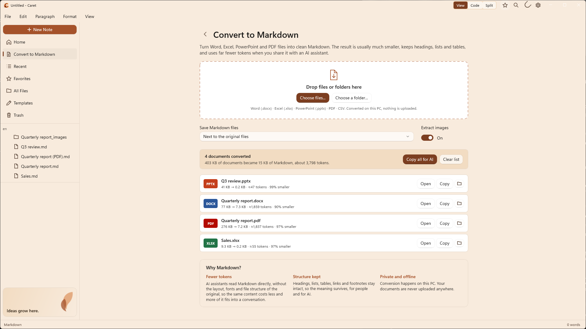
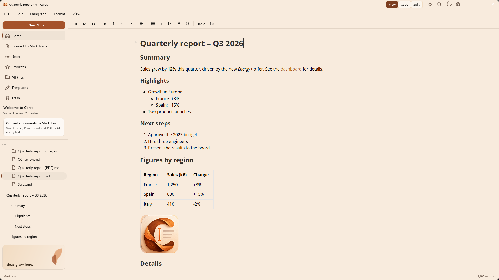
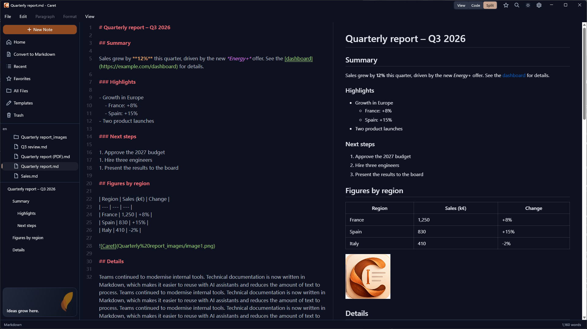

<p align="center">
  
</p>

<h1 align="center">Caret</h1>

<p align="center">
  <strong>Turn Office documents into AI-ready Markdown, and write beautifully on Windows.</strong>
</p>

<p align="center">
  
  
  
  <a href="LICENSE"></a>
</p>

<p align="center">
  English · <a href="README.fr.md">Français</a> · <a href="README.es.md">Español</a>
</p>

<p align="center">
  
</p>

---

## Why Caret

Most of what we know lives in Word documents, Excel workbooks, PowerPoint decks and PDFs. AI assistants like Copilot and ChatGPT work best with plain text, and every attached file costs tokens, time and upload limits.

**Caret converts those files to Markdown**: clean text that keeps the headings, lists, tables, links and footnotes and leaves out everything else. The result is typically **90–99% smaller** than the original file, readable by people and AI alike, and it never leaves your PC.

Then it gives you a calm, native Markdown editor to read, edit and organize the result.

| Example (from Caret's own tests) | Original | Markdown | ≈ Tokens |
| --- | --- | --- | --- |
| Quarterly report, Word | 77 KB | 7.3 KB | 1,859 |
| The same report as a PDF | 276 KB | 7.2 KB | 1,837 |
| Sales workbook, Excel | 9.3 KB | 0.2 KB | 55 |
| Review deck, PowerPoint | 41 KB | 0.2 KB | 47 |

Token counts are estimates (about four characters per token); the exact number depends on the AI model.

## Convert to Markdown

Open **Convert to Markdown** in the sidebar, right under Home, and drop in files or a whole folder.

- **Word** (.docx): headings, nested lists, bold and italic, links, tables with merged cells, footnotes and images
- **Excel** (.xlsx): every visible sheet as a table, with readable dates, percentages and formula results
- **PowerPoint** (.pptx): one section per slide, with bullet levels, tables and speaker notes
- **PDF**: headings, lists, tables and two-column layouts rebuilt from the page, with running headers and page numbers removed
- **CSV**: comma or semicolon, detected automatically

Each file shows its size before and after and roughly how many tokens it takes. **Copy all for AI** puts everything on the clipboard as one text, ready to paste into an assistant. Markdown files are saved next to the originals or in a folder you choose, and existing files are never overwritten.

**It's all built in**: no Python, no add-ins, no internet connection, nothing uploaded. That makes Caret suitable for company laptops where installing tools is restricted.

## A calm Markdown editor

<p align="center">
  
</p>

### Writing
- **View, Code or Split**: formatted editing, plain Markdown, or both side by side with a live preview
- **Formatting toolbar** and the Paragraph and Format menus, with familiar shortcuts
- **Tables, math, footnotes and diagrams**: Mermaid, flowcharts, sequence diagrams, PlantUML, Vega-Lite
- **Paste images and screenshots** straight into a note
- **Find & Replace**, undo and redo, spellcheck, and a live word count

### Organizing
- **Folder workspace** with a live file tree, **Go to File** (`Ctrl+K`), **Favorites**, **Recent** files, **Templates** and **Trash**
- **Multi-window**, and *Open with* integration for `.md` files

### Peace of mind
- **Auto save** that never replaces a saved file with an accidentally empty editor
- **Crash recovery** for unsaved work, even untitled notes
- **Safe links**: web links open in your browser; local links open documents and media only, never scripts

### At home on Windows
- **English, French and Spanish**, following your Windows language or chosen in Settings
- Light and dark themes, Mica, and export to HTML, PDF or plain text

<p align="center">
  
</p>

## Get Caret

- **Microsoft Store**: coming soon.
- **GitHub**: download the latest `.msix` and `Caret.cer` from [Releases](https://github.com/fegyenc/Caret/releases/latest). Because this package is signed with the project's own certificate, Windows needs to trust it once before the first install:
  1. Double-click `Caret.cer` → **Install Certificate…** → **Local Machine** → **Place all certificates in the following store** → **Trusted People**. Or, from PowerShell run as Administrator:
     ```ps
     Import-Certificate -FilePath "$env:USERPROFILE\Downloads\Caret.cer" -CertStoreLocation Cert:\LocalMachine\TrustedPeople
     ```
  2. Double-click the `.msix` and choose **Install**. Later versions install over the top.
- **For organizations**: [docs/deployment.md](docs/deployment.md) covers Intune, Company Portal, policies and network use.

Requires Windows 10 version 1809 or later (x64 or ARM64); Windows 11 recommended. Everything Caret needs is included in the package.

## Privacy

Caret collects nothing: no account, no telemetry. Documents are converted and edited on your PC. The only connection it makes on its own is a daily update check in the GitHub version, which you can turn off. The Store version doesn't make it at all. Details: [PRIVACY.md](PRIVACY.md).

## Keyboard shortcuts

| Action | Shortcut | | Action | Shortcut |
| --- | --- | --- | --- | --- |
| New note | `Ctrl+N` | | Bold | `Ctrl+B` |
| New window | `Ctrl+Shift+N` | | Italic | `Ctrl+I` |
| Open | `Ctrl+O` | | Underline | `Ctrl+U` |
| Go to file | `Ctrl+K` | | Heading 1–6 | `Ctrl+1` … `Ctrl+6` |
| Save | `Ctrl+S` | | Paragraph | `Ctrl+0` |
| Save as | `Ctrl+Shift+S` | | Task list | `Ctrl+Shift+X` |
| Find & Replace | `Ctrl+F` | | Quote | `Ctrl+Shift+Q` |
| Print | `Ctrl+P` | | Code block | `Ctrl+Shift+K` |
| Close window | `Ctrl+W` | | Table | `Ctrl+Shift+T` |

Undo, redo, cut, copy, paste and select all use the standard Windows shortcuts.

## Building from source

### Prerequisites

- [Visual Studio 2022](https://visualstudio.microsoft.com/vs/) with the **.NET desktop development** workload (**.NET 8 SDK**) and the **Windows App SDK C# Templates** component
- [Node.js](https://nodejs.org/) (LTS) with [Yarn](https://yarnpkg.com/)
- Git

### 1. Clone

```ps
git clone https://github.com/fegyenc/Caret
cd Caret
```

### 2. Build the editor bundle

The editor is a React app that is compiled into static files. The output is not checked in, so build it once, and again after changing anything under `Dev/Typedown.Editor`:

```ps
cd Dev\Typedown.Editor
yarn install
yarn build
```

The bundle lands in `Dev\Typedown.WinUI\Resources\Statics`, and the app build copies it from there.

### 3. Build and run

Open `Caret.sln` in Visual Studio, pick **x64** and one of these configurations, then press F5:

| Configuration | Use it for |
| --- | --- |
| `Debug_Local` | Everyday development. Loads the compiled editor bundle from step 2. |
| `Debug` | Editor development with hot reload. Loads the editor from `http://localhost:3000`, so run `yarn start` in `Dev\Typedown.Editor` alongside it. |
| `Release` | Produces the MSIX package (see [PACKAGING.md](PACKAGING.md), and [docs/store](docs/store) for the Store package). |

Or from the command line:

```ps
msbuild Caret.sln -restore -p:Configuration=Debug_Local -p:Platform=x64
```

## Project layout

| Path | What it is |
| --- | --- |
| `Caret.sln` | The Visual Studio solution. |
| `Dev/Typedown.WinUI` | **The Caret app**: WinUI 3 + WebView2 on .NET 8. Windows, menus, file handling, clipboard, export, settings. |
| `Dev/Typedown.WinUI/Services/Conversion` | The document converters (Word, Excel, PowerPoint, PDF, CSV → Markdown). Plain .NET, no UI. |
| `Dev/Typedown.WinUI/Strings` | Translations: `en`, `fr`, `es` (see [docs/localization.md](docs/localization.md)). |
| `Dev/Typedown.Editor` | The editor (React + TypeScript, Muya WYSIWYG engine, CodeMirror source mode, split preview). |
| `docs/` | Store listing and screenshots, deployment guide, localization guide. |

The project folders keep their original Typedown names for now. Source comments that mention paths like `Typedown.Core\…` point to the [upstream Typedown](https://github.com/byxiaozhi/Typedown) code each piece was ported from. [CHANGES.md](CHANGES.md) is a detailed log of everything Caret has added, reworked or fixed.

## Credits

Caret started as a fork of **[Typedown](https://github.com/byxiaozhi/Typedown)** by [ZZF](https://github.com/byxiaozhi), a lovely native Markdown editor left on the long-retired .NET Core 3.1 and WPF + XAML Islands stack. Caret moves it to WinUI 3 and .NET 8 and builds a lot on top. Credit for the original design and editor goes to ZZF and Typedown's contributors.

Caret also stands on:

- [Muya](https://github.com/marktext/muya), the WYSIWYG engine from [MarkText](https://github.com/marktext/marktext)
- [CodeMirror](https://codemirror.net/) for the source editor
- [Open XML SDK](https://github.com/dotnet/Open-XML-SDK) and [PdfPig](https://github.com/UglyToad/PdfPig) for reading Word, Excel, PowerPoint and PDF files
- [Microsoft MarkItDown](https://github.com/microsoft/markitdown), optional, for importing other formats
- [Windows App SDK](https://github.com/microsoft/WindowsAppSDK) and [WebView2](https://developer.microsoft.com/microsoft-edge/webview2/)

Licences for everything Caret includes are listed in [THIRD-PARTY-NOTICES.md](THIRD-PARTY-NOTICES.md).

## Contributing

Bug reports, ideas and translation reviews are welcome. Please open an [issue](https://github.com/fegyenc/Caret/issues) first to discuss a change, then send a [pull request](https://github.com/fegyenc/Caret/pulls).

## License

[MIT](LICENSE). The original Typedown copyright notice is preserved as the license requires, and Caret's changes are released under the same terms.
