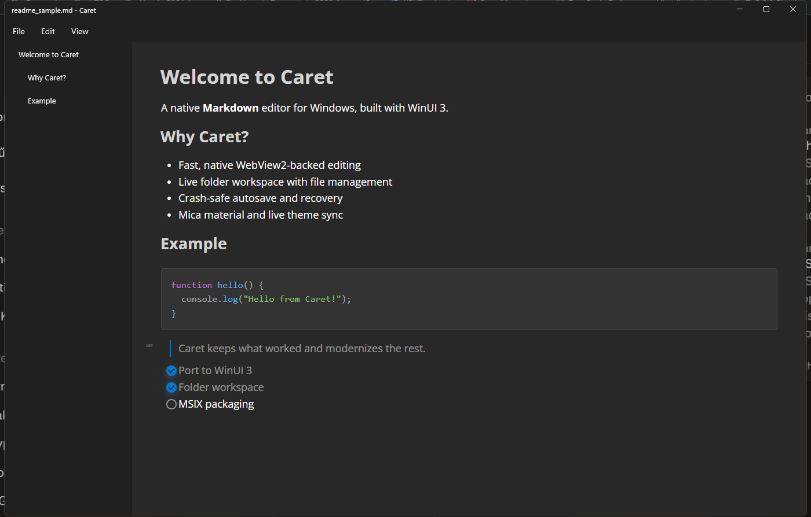

<p align="center">
  
  <h1 align="center">Caret</h1>
</p>

<p align="center">A native Markdown editor for Windows, built with WinUI 3.</p>

<p align="center">
  
</p>

Caret is a fork of [Typedown](https://github.com/byxiaozhi/Typedown) by [ZZF](https://github.com/byxiaozhi), ported from WPF + XAML Islands (stuck on the long-EOL .NET Core 3.1) to a native **WinUI 3 + WebView2** shell on **.NET 8**. Typedown's own React/CodeMirror-based Markdown editor ([Typedown.Editor](Dev/Typedown.Editor)) carries over unchanged — the rewrite is entirely in the native Windows host around it.

## Features

- **Markdown editing** — the original's WYSIWYG/source-mode editor (Muya + CodeMirror), Find & Replace, table of contents
- **Folder workspace** — a live, lazily-expanding file tree (not a one-shot scan) that picks up files created/renamed/deleted outside the app, with a New File / New Folder / Rename / Delete / Reveal in File Explorer context menu
- **Multi-window** — open several documents side by side in one running instance; opening a file that's already open elsewhere focuses that window instead of loading a second copy
- **Export & Print** — HTML, PDF, and plain text export, plus native printing
- **Image insertion** — pick a local image and it renders inline in the document
- **Crash recovery** — dirty documents (including a never-saved untitled one) are backed up in the background and offered back on next launch
- **Window memory** — position, size, and maximized state are restored across launches
- **Mica material** — native Windows 11 backdrop for the window chrome, optionally extended behind the editor content itself
- **Live theme sync** — light/dark/system theme and accent color follow Windows and push live into the editor, no restart needed

See [CHANGES.md](CHANGES.md) for what's been ported as-is, reimplemented against modern WinUI 3 APIs, or is still on the list.

## Screenshots

<figure>


</figure>

The editor surface above is Typedown's own and looks the same in Caret; the screenshot at the top of this README shows Caret's actual native shell (folder tree, title bar, Mica) around it.

## Building from source

### 1. Prerequisites

[Visual Studio 2022](https://visualstudio.microsoft.com/vs/) with the following individual components:
- **.NET desktop development** workload, with the **.NET 8 SDK**
- **Windows App SDK C# Templates** (installs the WinUI 3 tooling `Typedown.WinUI` needs)
- Git for Windows

[Node.js](https://nodejs.org/) with the following global package:
- [yarn](https://yarnpkg.com/)

### 2. Clone the repository

```ps
git clone https://github.com/fegyenc/Caret
```

### 3. Build the editor bundle

`Typedown.WinUI` embeds the same React/CodeMirror editor the original project used, and expects it pre-built — this step hasn't changed from upstream Typedown. From `Dev\Typedown.Editor`:

```ps
cd Caret\Dev\Typedown.Editor
yarn && yarn build
```

This produces the static bundle under `Dev\Typedown\Resources\Statics`, which `Typedown.WinUI`'s build copies into its own output.

### 4. Build and run Caret

Open `Caret\Typedown.sln` in Visual Studio 2022, set **Typedown.WinUI** as the startup project (it isn't the solution default — the original `Typedown` WPF project and its `Typedown.Core`/`Typedown.Editor` dependencies are still in the tree for reference, but `Typedown.WinUI` is the one under active development), pick a configuration:

- **Debug** — loads the editor from `http://localhost:3000`; also run `yarn start` in `Dev\Typedown.Editor` alongside it
- **Debug_Local** — loads the editor from the compiled bundle (step 3) — the usual choice
- **Release** — used for actual builds

...and a platform (x64, x86, or ARM64), then run.

## Project layout

| Path | What it is |
| --- | --- |
| `Dev/Typedown.WinUI` | **Caret's native shell** — WinUI 3 + WebView2, .NET 8. This is where active development happens. |
| `Dev/Typedown.Editor` | The Markdown editor itself (React/TypeScript), unchanged from upstream and shared by both shells. |
| `Dev/Typedown`, `Dev/Typedown.Core` | The original WPF + XAML Islands shell, kept for reference during the port. Not the build target. |

## Relationship to Typedown

Caret exists because Typedown — a genuinely good idea, a native Windows Markdown editor — had gone quiet on a deprecated .NET runtime. Rather than start over, this fork keeps Typedown's editor and ports its host to a toolchain with a future. All credit for the original design and the editor implementation goes to [ZZF](https://github.com/byxiaozhi) and Typedown's contributors.

## License

MIT — see [LICENSE](LICENSE). The original Typedown copyright notice is preserved as required by the license; Caret's own changes are contributed under the same terms.

## Contributing

Want to contribute? Open an [issue](https://github.com/fegyenc/Caret/issues) describing what you'd like to change before sending a [pull request](https://github.com/fegyenc/Caret/pulls).
