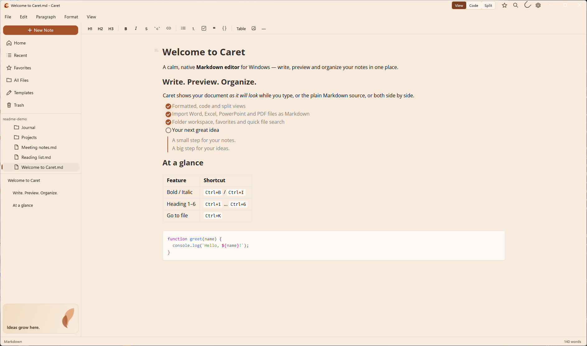
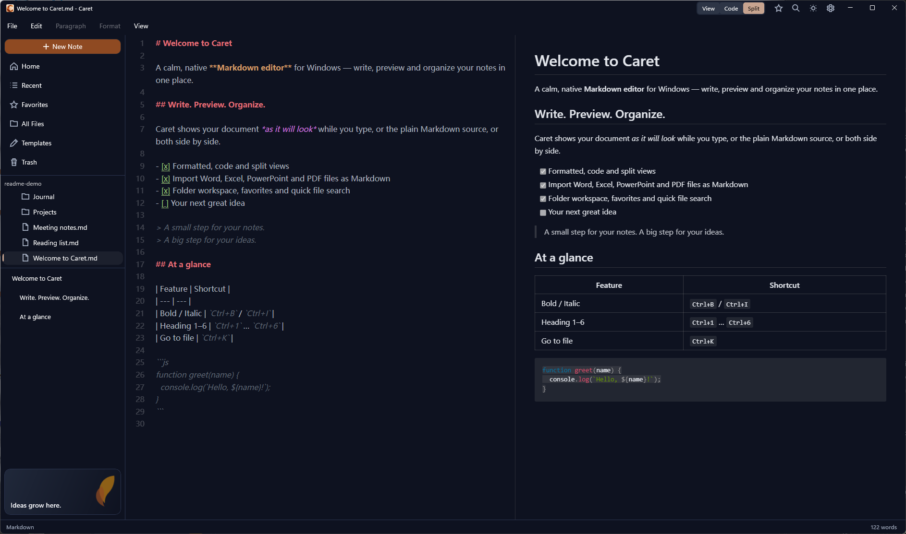

<p align="center">
  
</p>

<h1 align="center">Caret</h1>

<p align="center">
  <strong>A calm, native Markdown editor for Windows.</strong><br />
  Write, preview and organize your notes in one place.
</p>

<p align="center">
  
  
  
  <a href="LICENSE"></a>
</p>

<p align="center">
  
</p>

---

## Why Caret

Caret is a Markdown editor that feels like part of Windows. What you type is formatted as you write it, and the plain Markdown is always one click away. Your notes stay ordinary `.md` files in ordinary folders: no account, no cloud lock-in, no proprietary format.

It is built on **WinUI 3** and **.NET 8** with Mica, light and dark themes, and your Windows accent color. The editor surface is the proven Muya + CodeMirror engine from [Typedown](https://github.com/byxiaozhi/Typedown).

## Features

### Writing
- **Three ways to see a note**: **View** (formatted, WYSIWYG), **Code** (raw Markdown) or **Split** (source beside a live preview with synced scrolling). Switch from the title bar or the View menu.
- **Formatting toolbar, and Paragraph and Format menus**: headings, bold, italic, strikethrough, highlight, inline code, links, lists, task lists, quotes, code blocks and horizontal rules.
- **Rich blocks**: tables (choose the size, then resize them in place), math, footnotes, a table of contents, YAML front matter, and Mermaid, flowchart, sequence, PlantUML and Vega-Lite diagrams.
- **Images that just work**: paste a screenshot or a copied image file and Caret saves it (to `Pictures\Caret` or an `images` folder next to the note, your choice) and links it. Relative image paths render correctly.
- **Smart paste**: content copied from web pages and AI chats comes in as clean Markdown.
- **Find & Replace** with case-sensitive, whole-word and regex options.
- **Undo / Redo**, spellcheck, and a status bar with a live word count.

### Organizing
- **Folder workspace**: a live file tree that notices changes made outside Caret. Create, rename, cut, copy, paste and delete files, or reveal them in File Explorer.
- **Go to File** (`Ctrl+K`) to jump to any note in the open folder.
- **Favorites** (the ☆ in the title bar), **Recent** files, reusable **Templates**, and a **Trash** list of deleted notes. Deletions go to the Recycle Bin, so they can always be restored.
- **Multi-window**: open notes side by side. Opening a file that is already open brings its window forward.
- **Registers as a Markdown app**, so `.md` files can be opened with Caret from File Explorer's *Open with* menu.

### Importing and sharing
- **Import Word, Excel, PowerPoint, PDF and more** as Markdown through Microsoft's [MarkItDown](https://github.com/microsoft/markitdown). If MarkItDown is missing, Caret offers to install it for you.
- **Export** to HTML, PDF (page size, orientation, backgrounds, headers and footers) or plain text, and **print**.

### Peace of mind
- **Auto save**, with a guard that never replaces a saved file with an accidentally blank editor.
- **Crash recovery**: unsaved work, even an untitled note, is backed up in the background and offered back on the next launch.
- **Safe links**: web links open in your browser, and a local file link opens only documents and media. Anything else (like scripts) is revealed in File Explorer and never run.

### Feels at home on Windows
- Light, dark or system theme, switchable live from the title bar.
- Mica material, optionally extended behind the editor.
- Remembers window size and position. Optional *Always on top*.

<p align="center">
  
</p>

## Keyboard shortcuts

| Action | Shortcut | | Action | Shortcut |
| --- | --- | --- | --- | --- |
| New note | `Ctrl+N` | | Bold | `Ctrl+B` |
| New window | `Ctrl+Shift+N` | | Italic | `Ctrl+I` |
| Open | `Ctrl+O` | | Underline | `Ctrl+U` |
| Go to file | `Ctrl+K` | | Heading 1–6 | `Ctrl+1` … `Ctrl+6` |
| Save | `Ctrl+S` | | Paragraph | `Ctrl+0` |
| Save as | `Ctrl+Shift+S` | | Task list | `Ctrl+Shift+X` |
| Find & Replace | `Ctrl+F` | | Quote | `Ctrl+Shift+Q` |
| Print | `Ctrl+P` | | Code block | `Ctrl+Shift+K` |
| Close window | `Ctrl+W` | | Table | `Ctrl+Shift+T` |

Undo, redo, cut, copy, paste and select all use the standard Windows shortcuts.

## Installing

Download the latest `.msix` package and `Caret.cer` certificate from **[Releases](https://github.com/fegyenc/Caret/releases/latest)**.

Caret isn't on the Microsoft Store yet, so the package is signed with the project's own certificate, which Windows has to trust once before the first install:

1. **Trust the certificate.** Double-click `Caret.cer`, choose **Install Certificate…** → **Local Machine** → **Place all certificates in the following store** → **Trusted People**. Or, from PowerShell run as Administrator:
   ```ps
   Import-Certificate -FilePath "$env:USERPROFILE\Downloads\Caret.cer" -CertStoreLocation Cert:\LocalMachine\TrustedPeople
   ```
2. **Install.** Double-click the `.msix` file and choose **Install**.

Later versions install over the top without repeating step 1. The package includes everything Caret needs (.NET and the Windows App SDK). Requires Windows 10 version 1809 or later on x64 (Windows 11 recommended for Mica). Importing documents also needs Python, which MarkItDown runs on.

You can also build from source (below), or build and sign your own package with [PACKAGING.md](PACKAGING.md).

## Building from source

### Prerequisites

- [Visual Studio 2022](https://visualstudio.microsoft.com/vs/) with the **.NET desktop development** workload (**.NET 8 SDK**) and the **Windows App SDK C# Templates** component
- [Node.js](https://nodejs.org/) (LTS) with [Yarn](https://yarnpkg.com/)
- Git

### 1. Clone

```ps
git clone https://github.com/fegyenc/Caret
cd Caret
```

### 2. Build the editor bundle

The editor is a React app that is compiled into static files. The output is not checked in, so build it once, and again after changing anything under `Dev/Typedown.Editor`:

```ps
cd Dev\Typedown.Editor
yarn install
yarn build
```

The bundle lands in `Dev\Typedown.WinUI\Resources\Statics`, and the app build copies it from there.

### 3. Build and run

Open `Caret.sln` in Visual Studio, pick **x64** and one of these configurations, then press F5:

| Configuration | Use it for |
| --- | --- |
| `Debug_Local` | Everyday development. Loads the compiled editor bundle from step 2. |
| `Debug` | Editor development with hot reload. Loads the editor from `http://localhost:3000`, so run `yarn start` in `Dev\Typedown.Editor` alongside it. |
| `Release` | Produces the MSIX package (see [PACKAGING.md](PACKAGING.md)). |

Or from the command line:

```ps
msbuild Caret.sln -restore -p:Configuration=Debug_Local -p:Platform=x64
```

## Project layout

| Path | What it is |
| --- | --- |
| `Caret.sln` | The Visual Studio solution. |
| `Dev/Typedown.WinUI` | **The Caret app**: WinUI 3 + WebView2 on .NET 8. Windows, menus, file handling, clipboard, export, settings. |
| `Dev/Typedown.Editor` | The editor (React + TypeScript, Muya WYSIWYG engine, CodeMirror source mode, split preview). |
| `docs/` | Screenshots and documentation assets. |

The project folders keep their original Typedown names for now. Source comments that mention paths like `Typedown.Core\…` point to the [upstream Typedown](https://github.com/byxiaozhi/Typedown) code each piece was ported from.

[CHANGES.md](CHANGES.md) is a detailed log of everything Caret has added, reworked or fixed.

## Credits

Caret started as a fork of **[Typedown](https://github.com/byxiaozhi/Typedown)** by [ZZF](https://github.com/byxiaozhi). Typedown was a lovely native Markdown editor left on the long-retired .NET Core 3.1 and WPF + XAML Islands stack. Caret moves it to WinUI 3 and .NET 8 and builds a lot on top. Credit for the original design and editor goes to ZZF and Typedown's contributors.

Caret also stands on:

- [Muya](https://github.com/marktext/muya), the WYSIWYG engine from [MarkText](https://github.com/marktext/marktext)
- [CodeMirror](https://codemirror.net/) for the source editor
- [Microsoft MarkItDown](https://github.com/microsoft/markitdown) for document import
- [Windows App SDK](https://github.com/microsoft/WindowsAppSDK) and [WebView2](https://developer.microsoft.com/microsoft-edge/webview2/)

## Contributing

Bug reports and ideas are welcome. Please open an [issue](https://github.com/fegyenc/Caret/issues) first to discuss a change, then send a [pull request](https://github.com/fegyenc/Caret/pulls).

## License

[MIT](LICENSE). The original Typedown copyright notice is preserved as the license requires, and Caret's changes are released under the same terms.
