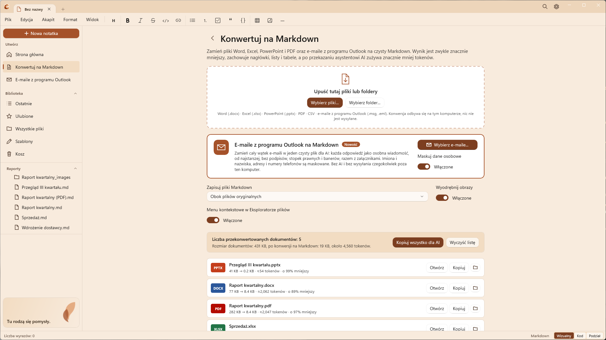
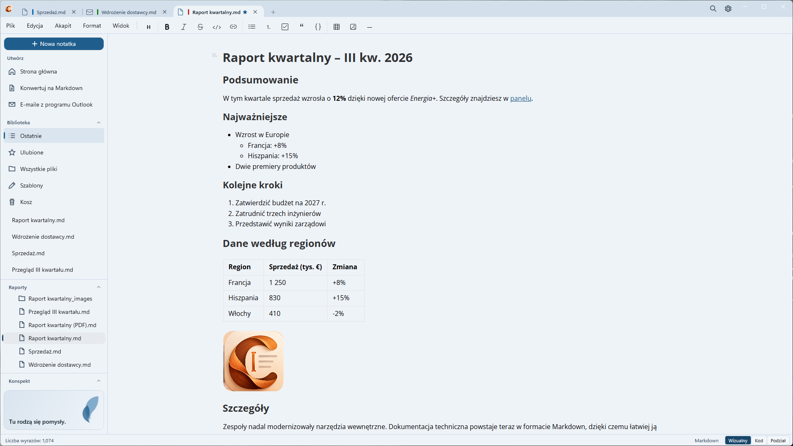

  

<h1 align="center">Caret</h1>

  <strong>Zamieniaj dokumenty pakietu Office na Markdown gotowy dla AI i pisz z przyjemnością w systemie Windows.</strong>

  <a href="README.md">English</a> · <a href="README.fr.md">Français</a> · <a href="README.es.md">Español</a> · Polski · <a href="README.pt.md">Português</a>

  

---

## Dlaczego Caret

Większość naszej wiedzy znajduje się w dokumentach Word, arkuszach Excel, prezentacjach PowerPoint i plikach PDF. Asystenci AI, tacy jak Copilot i ChatGPT, lepiej pracują ze zwykłym tekstem, a każdy dołączony plik kosztuje tokeny, czas i limity przesyłania.

**Caret konwertuje te pliki na Markdown**: czysty tekst, który zachowuje nagłówki, listy, tabele, łącza i przypisy, a pomija resztę. Wynik jest zwykle **o 90–99% mniejszy** niż plik oryginalny, czytelny dla ludzi i dla AI, i nigdy nie opuszcza Twojego komputera.

Następnie Caret daje Ci natywny, spokojny edytor Markdown do czytania, edytowania i porządkowania wyniku.

| Przykład (testy programu Caret) | Oryginał | Markdown | ≈ Tokeny |
| --- | --- | --- | --- |
| Raport kwartalny, Word | 77 KB | 8,8 KB | 2 183 |
| Ten sam raport w formacie PDF | 278 KB | 8,7 KB | 2 161 |
| Arkusz sprzedaży, Excel | 9,3 KB | 0,2 KB | 56 |
| Prezentacja, PowerPoint | 41 KB | 0,2 KB | 58 |

Liczba tokenów jest szacunkowa (około czterech znaków na token); dokładna liczba zależy od modelu AI.

## Konwersja na Markdown

Otwórz **Konwertuj na Markdown** na pasku bocznym, tuż pod pozycją Strona główna, i upuść pliki lub cały folder. Możesz też obejść się bez otwierania okna programu Caret: w Eksploratorze plików kliknij prawym przyciskiem myszy plik, kilka plików lub folder i wybierz **Konwertuj na Markdown** (w wersji ze sklepu Microsoft Store i w wersji instalowanej; administrator może to wyłączyć, zobacz [przewodnik wdrażania](docs/deployment.md)).

- **Word** (.docx): nagłówki, listy zagnieżdżone, pogrubienie i kursywa, łącza, tabele (także ze scalonymi komórkami), przypisy dolne i obrazy
- **Excel** (.xlsx): każdy widoczny arkusz jako tabela, z czytelnymi datami, wartościami procentowymi i wynikami formuł
- **PowerPoint** (.pptx): jedna sekcja na slajd, z poziomami punktorów, tabelami i notatkami prelegenta
- **PDF**: nagłówki, listy, kod, tabele (z liniami i bez, z zachowanymi nagłówkami obejmującymi kilka kolumn) oraz kolumny, odtworzone i czytane we właściwej kolejności; łącza internetowe zachowane, nagłówki i stopki stron, numery stron i pieczątki na marginesach usunięte
- **CSV**: przecinek lub średnik, wykrywane automatycznie
- **E-maile z programu Outlook** (.msg, .eml): cały wątek w jednym pliku, każda odpowiedź jako osobna wiadomość, od najstarszej do najnowszej, bez podpisów, stopek prawnych i banerów „nadawca zewnętrzny”, a załączniki przekonwertowane w tym samym miejscu. Mają własne wejście: **E-maile z programu Outlook** na pasku bocznym i na stronie głównej oraz karta z poleceniem **Wybierz e-maile...** na stronie konwersji. E-maile zapisane z programu Outlook (przeciągnięte z programu Outlook do folderu) można też upuścić jak każdy inny plik

**Maskuj dane osobowe** (domyślnie włączone, na karcie e-maili) zastępuje imiona i nazwiska, adresy e-mail, numery telefonów, numery IBAN, numery kart i dokumentów tożsamości symbolami zastępczymi, takimi jak `[PERSON-1]`, zawsze tym samym dla tej samej osoby, aby wątek pozostał czytelny po wklejeniu do asystenta AI. Działa to na podstawie reguł i sum kontrolnych, a nie AI: osoby są rozpoznawane po nadawcach i odbiorcach e-maila oraz po imionach w zwrotach powitalnych („Cześć Marto,”) i grzecznościowych, więc imię, które pojawia się tylko w środku zdania, nie zostanie znalezione. Rozumiane są e-maile po polsku, angielsku, francusku i hiszpańsku; reguły to [pliki JSON](plugins/markitdown-email/src/markitdown_caret_email/rules), które firma może uzupełnić.

Przy każdym pliku widać jego rozmiar przed konwersją i po niej oraz szacunkową liczbę tokenów. **Kopiuj wszystko dla AI** umieszcza całość w Schowku jako jeden tekst, gotowy do wklejenia w asystencie. Pliki Markdown są zapisywane obok oryginałów lub w wybranym folderze, a żaden istniejący plik nie jest nigdy nadpisywany.

**Wszystko jest wbudowane**: bez środowiska Python, bez dodatków i bez połączenia z internetem; nic nie jest wysyłane online. Dzięki temu Caret nadaje się do komputerów firmowych, na których instalowanie narzędzi jest ograniczone.

## Spokojny edytor Markdown

  

- **Wizualny, Kod lub Podział**: edycja z formatowaniem, surowy Markdown albo oba widoki obok siebie z podglądem na żywo
- **Pasek narzędzi formatowania**, menu Akapit i Format oraz znane skróty klawiszowe
- **Tabele, wzory, przypisy dolne i diagramy** (Mermaid, schematy blokowe, diagramy sekwencji, PlantUML, Vega-Lite)
- **Wklejaj obrazy i zrzuty ekranu** bezpośrednio do notatki
- **Karty**: kilka dokumentów w jednym oknie, każdy z własną historią cofania. `Ctrl+Tab` przełącza między nimi, `Ctrl+W` zamyka dokument, a okno pozostaje otwarte ze stroną główną. Zapisane dokumenty otwierają się ponownie po następnym uruchomieniu (można to wyłączyć w Ustawieniach)
- **Obszar roboczy oparty na folderze**, **Przejdź do pliku** (`Ctrl+K`), ulubione, ostatnie pliki, szablony i kosz
- **Zapisywanie automatyczne** i **odzyskiwanie po awarii**, także dla notatek bez nazwy
- **Sprawdzanie pisowni** z czerwonym falistym podkreśleniem i propozycjami po kliknięciu prawym przyciskiem myszy, oparte na wbudowanym sprawdzaniu pisowni systemu Windows, bez połączenia z internetem
- **Recenzowanie jak w programie Word, tylko w kolorach**: komentarze na żółto, dodany tekst na zielono, usunięty na czerwono; zaakceptuj lub odrzuć każdą zmianę albo wszystkie naraz, a po otrzymaniu zmienionego pliku porównaj go z wersją wysłaną. Wszystko jest zapisane w samym dokumencie jako zwykły tekst ([CriticMarkup](https://criticmarkup.com)), który czyta zarówno człowiek, jak i asystent AI
- **Polski, angielski, francuski i hiszpański**, motywy jasny i ciemny, eksport do HTML, PDF lub zwykłego tekstu

## Pobierz program Caret

- **Microsoft Store** (zalecane): [pobierz program Caret ze sklepu Microsoft Store](https://apps.microsoft.com/detail/9n617shlqm8g) lub uruchom `winget install --source msstore --id 9N617SHLQM8G`. Bez certyfikatu do zatwierdzania, a aktualizacje instalują się same.
- **GitHub**: pobierz najnowszy plik `.msix` i `Caret.cer` z [opublikowanych wersji](https://github.com/fegyenc/Caret/releases/latest), a następnie wykonaj dwa kroki instalacji opisane w [angielskim README](README.md#get-caret).
- **Dla dużych firm, małych i średnich przedsiębiorstw oraz osób prowadzących jednoosobową działalność**: [docs/deployment.md](docs/deployment.md) opisuje wdrażanie za pomocą usługi Intune i Portalu firmy, wykorzystanie sieci oraz zasady, które wyłączają sprawdzanie aktualizacji albo ustawiają dla wszystkich domyślny układ i kolory (po angielsku).

Wymaga systemu Windows 10 w wersji 1809 lub nowszej (x64 lub ARM64); zalecany jest system Windows 11.

## Prywatność

Caret niczego nie zbiera: bez konta, bez telemetrii. Dokumenty są konwertowane i edytowane na Twoim komputerze. Jedyne połączenie, które Caret nawiązuje samodzielnie, to sprawdzanie aktualizacji mniej więcej raz dziennie w wersjach niezainstalowanych ze sklepu Microsoft Store (z serwisu GitHub albo pakiet wdrożony przez Twoją organizację); można je wyłączyć, a wersja ze sklepu w ogóle go nie wykonuje. Szczegóły: [PRIVACY.md](PRIVACY.md#polski).

## Licencja i współpraca

[Licencja MIT](LICENSE). Caret jest pochodną projektu [Typedown](https://github.com/byxiaozhi/Typedown) autorstwa ZZF. Składniki innych firm wymieniono w pliku [THIRD-PARTY-NOTICES.md](THIRD-PARTY-NOTICES.md). Uwagi, pomysły i poprawki tłumaczenia są mile widziane w [zgłoszeniach na GitHubie](https://github.com/fegyenc/Caret/issues); zobacz też [docs/localization.md](docs/localization.md).
