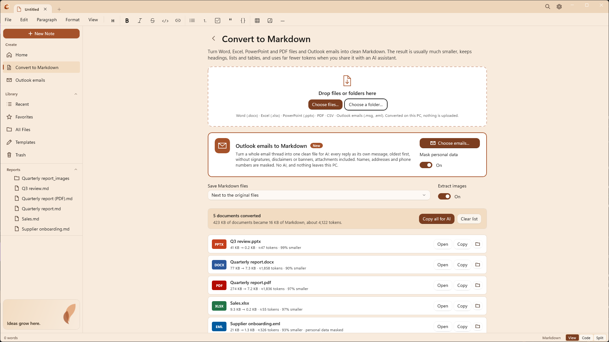
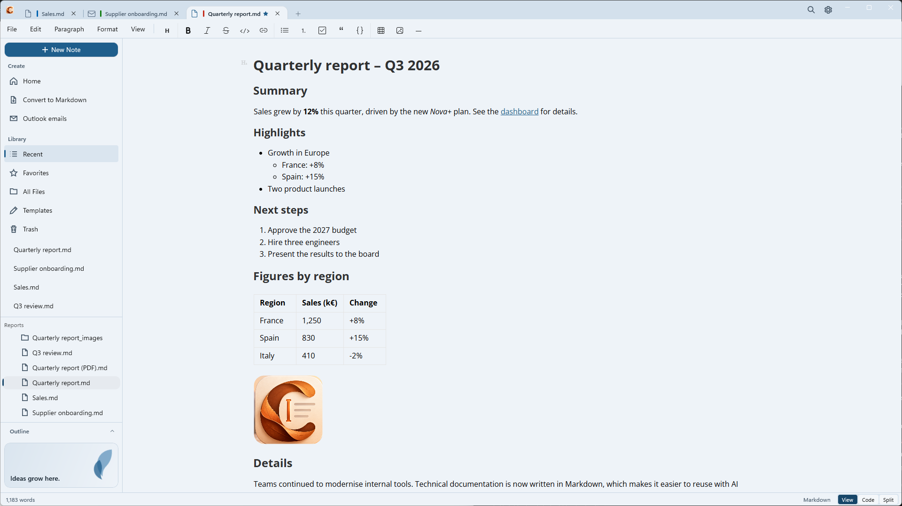

  

<h1 align="center">Caret</h1>

  <strong>Transforme seus documentos do Office em Markdown pronto para a IA e escreva com tranquilidade no Windows.</strong>

  <a href="README.md">English</a> · <a href="README.fr.md">Français</a> · <a href="README.es.md">Español</a> · <a href="README.pl.md">Polski</a> · Português

  

---

## Por que o Caret

Boa parte do que sabemos está em documentos do Word, pastas de trabalho do Excel, apresentações do PowerPoint e PDFs. Assistentes de IA como o Copilot e o ChatGPT funcionam melhor com texto simples, e cada arquivo anexado custa tokens, tempo e limites de envio.

**O Caret converte esses arquivos em Markdown**: um texto limpo que mantém os títulos, listas, tabelas, links e notas de rodapé e deixa de fora todo o resto. O resultado costuma ser **de 90 a 99% menor** que o arquivo original, é lido tão bem por pessoas quanto pela IA e nunca sai do seu PC.

Depois, o Caret oferece um editor de Markdown nativo e tranquilo para ler, editar e organizar o resultado.

| Exemplo (testes do próprio Caret) | Original | Markdown | ≈ Tokens |
| --- | --- | --- | --- |
| Relatório trimestral, Word | 77 KB | 7,3 KB | 1.859 |
| O mesmo relatório em PDF | 276 KB | 7,2 KB | 1.837 |
| Pasta de vendas, Excel | 9,3 KB | 0,2 KB | 55 |
| Apresentação, PowerPoint | 41 KB | 0,2 KB | 47 |

O número de tokens é uma estimativa (cerca de quatro caracteres por token); o valor exato depende do modelo de IA.

## Converter em Markdown

Abra **Converter em Markdown** na barra lateral, logo abaixo de Início, e solte arquivos ou uma pasta inteira. Ou, sem abrir a janela do Caret: clique com o botão direito em um arquivo, em vários arquivos ou em uma pasta no Explorador de Arquivos e escolha **Converter em Markdown** (na versão da Store e na versão instalada; um administrador pode desativar, veja o [guia de implantação](docs/deployment.md), em inglês).

- **Word** (.docx): títulos, listas aninhadas, negrito e itálico, links, tabelas (inclusive com células mescladas), notas de rodapé e imagens
- **Excel** (.xlsx): cada planilha visível como tabela, com datas, porcentagens e resultados de fórmulas legíveis
- **PowerPoint** (.pptx): uma seção por slide, com níveis de marcadores, tabelas e anotações do apresentador
- **PDF**: títulos, listas, código, tabelas (com ou sem linhas, mantendo os títulos que abrangem várias colunas) e colunas reconstruídos e lidos na ordem certa, links da web mantidos, sem cabeçalhos, números de página nem carimbos nas margens
- **CSV**: vírgula ou ponto e vírgula, detectados automaticamente
- **E-mails do Outlook** (.msg, .eml): a conversa inteira em um único arquivo, cada resposta como uma mensagem própria, da mais antiga para a mais recente, sem assinaturas, avisos legais nem banners de "remetente externo", com os anexos convertidos no mesmo lugar. Eles têm acesso próprio: **E-mails do Outlook** na barra lateral e em Início, e um cartão com **Escolher e-mails...** na página de conversão. Os e-mails salvos pelo Outlook (arrastados do Outlook para uma pasta) também podem ser soltos como qualquer arquivo

**Ocultar dados pessoais** (ativado por padrão, no cartão de e-mails) substitui nomes, endereços de e-mail, telefones, IBANs, números de cartão e de documentos de identidade (inclusive o CPF e o CNPJ brasileiros) por marcadores como `[PERSON-1]`, sempre o mesmo para a mesma pessoa, para que a conversa continue legível quando você colar em um assistente de IA. Funciona com regras e dígitos verificadores, não com IA: as pessoas são reconhecidas pelos remetentes e destinatários do e-mail e pelos nomes em saudações ("Olá, Daniel,") e despedidas, então um nome que aparece apenas no meio de uma frase não é encontrado. Entende e-mails em português, inglês, francês, espanhol e polonês; as regras são [arquivos JSON](plugins/markitdown-email/src/markitdown_caret_email/rules) que uma empresa pode ampliar.

Cada arquivo mostra o tamanho antes e depois e uma estimativa de seus tokens. **Copiar tudo para a IA** coloca tudo na Área de Transferência como um único texto, pronto para colar em um assistente. Os arquivos Markdown são salvos ao lado dos originais ou em uma pasta que você escolher, e nenhum arquivo existente é sobrescrito.

**Tudo já vem incluído**: sem Python, sem suplementos, sem conexão com a internet e sem enviar nada. Por isso o Caret também serve para notebooks de empresa em que instalar ferramentas é restrito.

## Um editor de Markdown tranquilo

  

- **Visual, Código ou Dividido**: edição com formatação, Markdown simples, ou os dois lado a lado com visualização ao vivo
- **Barra de ferramentas de formatação**, menus Parágrafo e Formatar e atalhos conhecidos
- **Tabelas, fórmulas, notas de rodapé e diagramas** (Mermaid, fluxogramas, diagramas de sequência, PlantUML, Vega-Lite)
- **Cole imagens e capturas de tela** direto em uma nota
- **Guias**: vários documentos em uma mesma janela, cada um com seu próprio histórico de desfazer. `Ctrl+Tab` alterna entre eles e `Ctrl+W` fecha o documento, deixando a janela aberta em uma página inicial. Seus documentos salvos são reabertos quando o Caret inicia (dá para desativar em Configurações)
- **Espaço de trabalho por pasta**, **Ir para o arquivo** (`Ctrl+K`), favoritos, arquivos recentes, modelos e Lixeira
- **Modelos iniciais** em todos os idiomas do Caret
- **Salvamento automático** e **recuperação após falha**, até para notas sem título
- **Verificação ortográfica** com sublinhado ondulado vermelho e sugestões no clique com o botão direito, usando o corretor do Windows (offline), nos idiomas que você tem no Windows
- **Revisão em cores**: comentários em amarelo, adições em verde, exclusões em vermelho; aceite ou rejeite cada alteração ou todas de uma vez e compare um arquivo com uma versão anterior para ver o que um colega mudou. Tudo é texto simples dentro do documento ([CriticMarkup](https://criticmarkup.com)), que pessoas e assistentes de IA conseguem ler. Sem servidor e sem conta
- **Copiar como texto do WhatsApp** (menu Editar): coloca a seleção, ou a nota inteira, na Área de Transferência com a formatação do WhatsApp, para colar direto em uma conversa
- **Português (Brasil), inglês, francês, espanhol e polonês**, temas claro e escuro, exportação para HTML, PDF ou texto simples

## Obtenha o Caret

- **Microsoft Store** (recomendado): [obtenha o Caret na Microsoft Store](https://apps.microsoft.com/detail/9n617shlqm8g) ou execute `winget install --source msstore --id 9N617SHLQM8G`. Não há certificado para confiar e ele se atualiza sozinho.
- **GitHub**: baixe o `.msix` e o `Caret.cer` mais recentes nas [versões publicadas](https://github.com/fegyenc/Caret/releases/latest) e siga os dois passos de instalação do [README em inglês](README.md#get-caret).
- **Para grandes empresas, PMEs e autônomos**: o [docs/deployment.md](docs/deployment.md) (em inglês) explica a implantação com o Intune e o Portal da Empresa, o uso da rede e as políticas que desativam a busca de atualizações ou definem o layout e as cores padrão para todos.

Requer o Windows 10 versão 1809 ou posterior (x64 ou ARM64); recomendamos o Windows 11.

## Privacidade

O Caret não coleta nada: sem conta e sem telemetria. Os documentos são convertidos e editados no seu PC. A única conexão que o Caret faz por conta própria é uma busca de atualizações, cerca de uma vez por dia, nas versões que não são instaladas pela Microsoft Store (a do GitHub ou um pacote que a sua organização distribui), e você pode desativá-la; a versão da Store nunca faz isso. Mais detalhes: [PRIVACY.md](PRIVACY.md) (em inglês, francês, espanhol e polonês).

## Licença e contribuições

[Licença MIT](LICENSE). O Caret deriva do [Typedown](https://github.com/byxiaozhi/Typedown), de ZZF. Os componentes de terceiros estão listados em [THIRD-PARTY-NOTICES.md](THIRD-PARTY-NOTICES.md). Sugestões, ideias e revisões de tradução são bem-vindas pelas [issues do GitHub](https://github.com/fegyenc/Caret/issues); veja também [docs/localization.md](docs/localization.md).